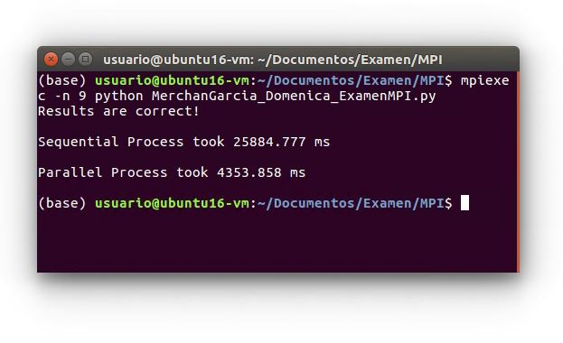

# Examen MPI

Este algoritmo se paralelizó mediante la división de las filas de la matriz de tamaño 4000000x10 entre los diferentes procesos. 
Cada proceso estaba a cargo de realizar el conteo de los valores dentro de los rangos establecidos en las filas que se le asignó. 

El proceso en paralelo se ejecutó con 9 procesos, el proceso 0 encargado de la distribución de los datos y los siguientes 8 procesos para 
el proceso de conteo. Mediante esta implementación se logró mejorar el tiempo de ejecución de ~25 segundos (en una ejecución secuencial)
a ~4 segundos utilizando 8 procesos trabajando en paralelo.

El programa se ejecuta mediante la siguiente línea de comando
### mpiexec -n 9 python MerchanGarcia_Domenica_ExamenMPI.py

